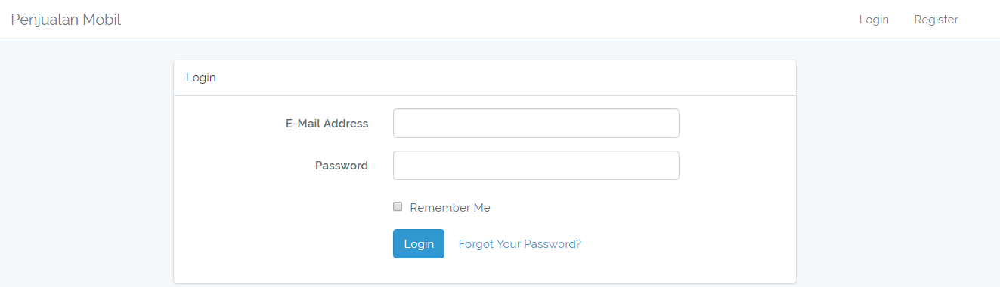
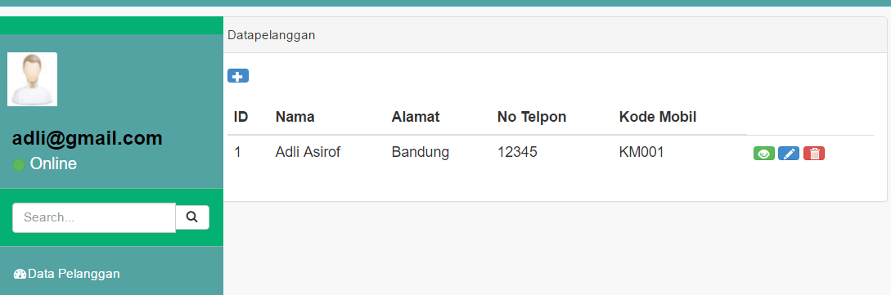
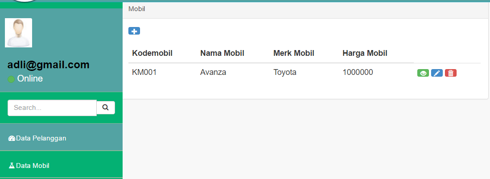
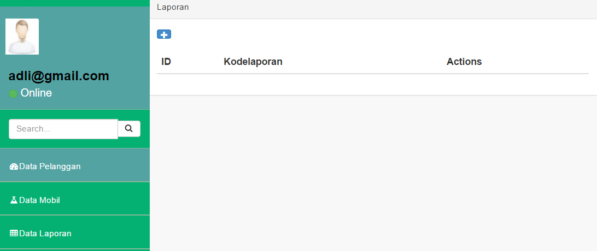
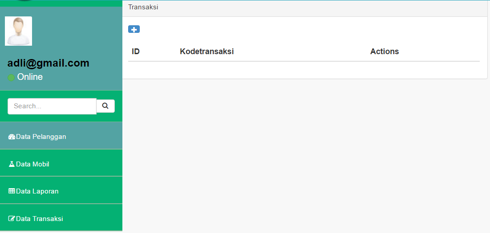

**BAB IV**

**IMPLEMENTASI DAN PENGUJIAN**

1.  **Lingkungan Implementasi**

    Pada bab ini membahas tentang implementasi dari perancangan yang dibuat.
    Serta melakukan pengujian terhadap aplikasi yang dibuat untuk mengetahui
    apakah aplikasi tersebut telah berjalan sesuai dengan yang diharapkan.
    Sebelum diimplementasikan, terlebih dahulu dipaparkan spesifikasi sistem
    sistem perangkat lunak (*Software)* maupun perangkat keras (*Hardware)* yang
    dibutuhkan untuk mendukung program aplikasi yang akan dibangun.

    1.  **Kebutuhan Perangkat Lunak**

Perangkat Lunak yang dibutuhkan dalam Sistem Penjualan Mobil adalah sebagai
berikut:

| No. | Tools/Software                  | Fungsi                              |
|-----|---------------------------------|-------------------------------------|
| 1.  | Microsoft Windows 10 pro 64 bit | Sistem Operasi                      |
| 2.  | MySQL                           | Database                            |
| 3.  | Laravel 5.3                     | Laravel Object Oriented Programming |
| 4.  | Xampp 7.0.13                    | Server                              |

*Tabel 4.1 Software penjualan mobil*

1.  **Kebutuhan Perangkat Keras**

Perangkat Keras yang dibutuhkan dalam Sistem Penjualan Mobil adalah sebagai
berikut:

| No. | Nama Perangkat | Spesifikasi             | Keterangan                                                                                        |
|-----|----------------|-------------------------|---------------------------------------------------------------------------------------------------|
| 1.  | *Processor*    | AMD A10-7400P Radeon R6 | Untuk kecepatan transfer data dari sistem yang sangat bergantung pada kecepatan prosesor komputer |

*Tabel 4.2 Deskripsi Perangkat Keras Server*

*Tabel 4.2 Deskripsi Perangkat Keras Server (Lanjutan)*

| No. | Nama Perangkat         | Spesifikasi    | Keterangan                                                                                        |
|-----|------------------------|----------------|---------------------------------------------------------------------------------------------------|
| 2.  | *Memory*               | 2 GB           | *Memory System* yang digunakan                                                                    |
| 3.  | *Hardisk*              | 320 GB         | Media untuk menyimpan data aplikasi yang dibuat                                                   |
| 4.  | *Mouse dan Keyboard*   | Standar        | Alat Pendukung                                                                                    |
| 5.  | Infrastruktur jaringan |                | Bisa dianalogikan sebagai alur proses dari titik awal proses sampai pada akhir proses             |
| No. | Nama Perangkat         | Spesifikasi    | Keterangan                                                                                        |
| 1.  | *Processor*            | *Intel inside* | Untuk kecepatan transfer data dari sistem yang sangat bergantung pada kecepatan prosesor komputer |
| 2.  | *Memory*               | 3GB            | *Memory System* yang digunakan                                                                    |
| 3.  | *Hardisk*              | 320 GB         | Media untuk menyimpan data aplikasi yang dibuat                                                   |

*Tabel 4.3 Deskripsi Perangkat Keras Client*

| No | Nama Perangkat         | Spesifikasi | Keterangan                                                                            |
|----|------------------------|-------------|---------------------------------------------------------------------------------------|
| 4. | Infrastruktur jaringan |             | Bisa dianalogikan sebagai alur proses dari titik awal proses sampai pada akhir proses |

*Tabel 4.3 Deskripsi Perangkat Keras Client (Lanjutan)*

1.  **Pembahasan Hasil Implementasi**

Berdasarkan perancangan yang telah dibuat untuk antar muka, didapat hasil dari
implementasi yang terdiri dari beberapa cuplikan Halaman antara lain:

1.  **Halaman Utama**

*Gambar 4.1 Halaman Utama*

Pembahasan Halaman Utama:

Halaman Utama adalah halaman utama yang merupakan tampilan awal dapat login
untuk melihat data mobil, data pelanggan, data transaksi dan laporan.

1.  **Halaman Login**

>   *Gambar 4.2 Halaman Login*

Pembahasan Halaman Login:

Pelanggan dan Admin melakukan login terlebih dahulu agar dapat masuk ke halaman
utama. Pelanggan dan admin menginputkan Email, password. Kemudian klik Button
login. Jika pelanggan login berhasil maka akan masuk ke halaman user, jika Admin
login berhasil maka akan masuk ke halaman Admin jika salah maka muncul informasi
yang memberitahukan bahwa Email atau password salah.

1.  **Halaman Data Pelanggan**

    

>   *Gambar 4.3 Halaman data pelanggan*

Pembahasaan halaman data pelanggan :

Admin bisa melakukan mengedit data pelanggan, tambah data pelanggan dan bisa
menghapus data pelanggan

1.  **Halaman Data Mobil**

    

>   *Gambar 4.4 Halaman data pelanggan*

Pembahasaan halaman data mobil :

Admin bisa melakukan mengedit data mobil, tambah data mobil dan bisa menghapus
data mobil

1.  **Halaman Laporan**

    

>   *Gambar 4.5 Halaman laporan*

Pembahasaan halaman data laporan :

Admin bisa melakukan mengedit data laporan, tambah data laporan dan bisa
menghapus data laporan

1.  **Halaman Transaksi**

    

>   *Gambar 4.6 Halaman Transaksi*

Pembahasaan halaman data transaksi :

Admin bisa melakukan mengedit data transaksi, tambah data transaksi dan bisa
menghapus data transaksi

Pengujian Dan Hasil Pengujan
----------------------------

Pengujian merupakan hal terpenting yang bertujuan untuk menemukan
kesalahan-kesalahan atau kekurangan-kekurangan pada perangkat lunak yang akan
diuji. Pengujian bermaksud untuk mengetahui perangkat lunak yang dibuat sudah
memenuhi kriteria yang sesuai dengan tujuan perancangan perangkat lunak
tersebut.

1.  **Identifikasi Dan Rencana Pengujian**

Pengujian yang dilakukan yaitu dengan pengujian *Blackbox,* Pengujian *BlackBox*
Digunakan untuk menguji fungsi-fungsi khusus dari perangkat lunak yang
dirancang.

Tabel 4.4 Identifikasi dan perencanaan pengujian

| **No** | **Kelas Uji**                        | **Butir Uji**                       | **Jenis Pengujian** |
|--------|--------------------------------------|-------------------------------------|---------------------|
| 1      | Login                                | Validasi Login Pelanggan            | *Blackbox*          |
|        |                                      | Validasi Login Admin                | *Blackbox*          |
| 2      | Login sosial media                   | Validasi Login facebook dan google+ | *Blackbox*          |
| 3      | Tampilan halaman data mobil          | Input Data mobil                    | *Blackbox*          |
|        |                                      | Edit Data mobil                     | *Blackbox*          |
|        |                                      | Delete data mobil                   | *Blackbox*          |
| 4      | Halaman data pelanggan               | Input Data pelanggan                | *Blackbox*          |
|        |                                      | Edit Data pelanggan                 | *Blackbox*          |
|        |                                      | Delete data pelanggan               | *Blackbox*          |
| 5      | Tampil Halaman Kelola Data transaksi | Input Data transaksi                | *Blackbox*          |
|        |                                      | Edit Data transaksi                 | *Blackbox*          |
|        |                                      | Delete data transaksi               | *Blackbox*          |

*Tabel 4.4 Identifikasi dan perencanaan pengujian* (Lanjutan)

| **No** | **Kelas Uji**          | **Butir Uji**                       | **Hasil Pengujian** |
|--------|------------------------|-------------------------------------|---------------------|
| 6      | Tampil Halaman Laporan | Lihat Data penjualan atau pembelian | *Blackbox*          |
|        |                        | Cetak Data penjualan atau pembelian | *Blackbox*          |

1.  **Deskripsi dan Hasil Uji**

    1.  **Pengujian Login**

Tabel 4.5 Pengujian Login

| **Kelas Uji** | **Butir Uji**            | **Hasil yang Diharapkan**       | **Kesimpulan** |
|---------------|--------------------------|---------------------------------|----------------|
| Login         | Validasi Login Pelanggan | Menampilkan halaman user        | Berhasil       |
|               | Validasi Login Admin     | Menampilkan halaman Utama admin |                |

1.  **Pengujian Input Data Pelanggan**

Tabel 4.6 Pengujian Input Data pelanggan

| **Kelas Uji**                | **Butir Uji**         | **Hasil yang Diharapkan**                            | **Kesimpulan** |
|------------------------------|-----------------------|------------------------------------------------------|----------------|
| Halaman Utama data pelanggan | Input Data pelanggan  | Data dapat terinput kedatabase dan dapat ditampilkan | Berhasil       |
|                              | Edit Data pelanggan   | Data pada database dapat terupdate                   |                |
|                              | Tambah Data pelanggan | Data pada database dapat otomatis menambah           |                |

1.  **Pengujian Input Data Mobil**

*Tabel 4.7 Pengujian Tampil Halaman Input Data mobil*

| **Kelas Uji**            | **Butir Uji**     | **Hasil yang Diharapkan**                            | **Kesimpulan** |
|--------------------------|-------------------|------------------------------------------------------|----------------|
| Halaman Utama data mobil | Input Data mobil  | Data dapat terinput kedatabase dan dapat ditampilkan | Berhasil       |
|                          | Edit Data mobil   | Data pada database dapat terupdate                   |                |
|                          | Tambah Data mobil | Data pada database dapat otomatis menambah           |                |
|                          | Delete Data mobil | Data pada databse terhapus secara otomatis           |                |

1.  **Pengujian Input Konfirmasi Transaksi**

*Tabel 4.8 Pengujian Tampil Halaman Input Data transaksi*

| **Kelas Uji**                    | **Butir Uji**         | **Hasil yang Diharapkan**          | **Kesimpulan** |
|----------------------------------|-----------------------|------------------------------------|----------------|
| Tampil form konfirmasi transaksi | Update konfirmasi     | Data dapat update kedatabase       | Berhasil       |
|                                  | Simpan Data transaksi | Data pada database dapat Tersimpan |                |
|                                  | View data transaksi   | Data pada database dapat di view   |                |

1.  **Pengujian Laporan**

*Tabel 4.9 Pengujian Tampil Halaman Laporan*

| **Kelas Uji**          | **Butir Uji**                       | **Hasil yang Diharapkan**                                            | **Kesimpulan** |
|------------------------|-------------------------------------|----------------------------------------------------------------------|----------------|
| Tampil Halaman Laporan | Lihat data penjualan atau pembelian | Data penerimaan.                                                     | Berhasil       |
|                        | Cetak Laporan                       | Data Laporan data penjualan atau pembelian yang ditampilkan tercetak |                |
