**BAB III**

**ANALISI DAN PERANCANGAN**

1.  **Analasis Sistem**

    Analisis sistem dapat didefinisikan sebagai penguraian dari suatu sistem
    informasi yang utuh kedalam bagian-bagian komponennya dengan maksud untuk
    mengidentifikasi dan mengevaluasi permasalahan-permasalahan,
    kesempatan-kesempatan, hambatan-hambatan yang terjadi dan
    kebutuhan-kebutuhan yang diharapkan sehingga dapat diusulkan
    perbaikan-perbaikannya.

    Pada bagian ini, akan dibahas mengenai analisis prosedur dan aliran dokumen
    yang sedang berjalan yang digambarkan dalam bentuk *flowmap,* pengkodean dan
    analisis sistem non fungsional yang meliputi perangkat keras dan perangkat
    lunak yang digunakan, serta analisis *user* yang terlibat dalam aplikasi
    pengelolaan data sistem informasi yang ada di penjualan mobil.

    1.  **Analisis Sistem yang Sedang Berjalan**

>   Analisis sistem yang sedang berjalan merupakan pemahaman terhadap sistem
>   yang berjalan. Yang nantinya dari permasalahan yang terdapat di dalam
>   analisis sistem berjalan itu, akan dibangun sebuah sistem baru yang akan
>   memperbaharui sistem informasi yang sudah ada atau sedang berjalan.

### **3.1.1.1. Analisis Prosedur (Flowmap)**

**A. Analisis sistem yang berjalan pada prosedur Penjualan Mobil**

>   [./media/image1.png](./media/image1.png)

>   *Gambar 3.1 Flowmap analisis sistem yang berjalan pada penjualan mobil*

>   **3.1.1.2. Analisis Dokumen Yang Sedang Berjalan**

>   Tabel 3.1 Analisi Dokumen Yang Digunakan

| No | Nama Dokumen   | Pembuatan | Isi Dokumen | Kegunaan            |                          |
|----|----------------|-----------|-------------|---------------------|--------------------------|
|    |                | Dari      | Kepada      |                     |                          |
| 1  | Data transaksi | Dealer    | Admin       | Transaksi pembelian | Sebagai bukti pembayaran |

1.  **Analisis Sistem Yang Akan Dibangun**

    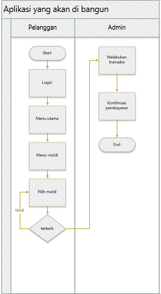

>   *Gambar 3.2 Flowmap analisis sistem yang berjalan pada penjualan mobil*

1.  **Kebutuhan Fungsional**

    Kebutuhan fungsional dalam aplikasi ini adalah sebagai berikut :

2.  Admin adalah pihak yang dapat mengakses sistem untuk nambah data, update
    data dan hapus data, dimana Admin harus login terlebih dahulu untuk menjaga
    data didalam sistem karena menyangkut rahasia showroom mobil.

3.  Pelanggan adalah pihak yang hanya dapat mengkases tampilan showroom.

4.  Data transaksi digunakan untuk memberikan informasi untuk melakukan
    pembayaran.

    1.  **Kebutuhan Non-Fungsional**

        Kebutuhan Non Fungsional adalah spesifikasi kebutuhan yang menyangkut
        perangkat lunak (*software)*, perangkat keras (*hardware)* yang
        dibutuhkan untuk pembuatan sistem.

5.  **Kebutuhan Perangkat Lunak / Software**

    Tabel 3.2 Kebutuhan Perangkat Lunak

| No | Perangkat Lunak      | Keterangan     |
|----|----------------------|----------------|
|    | *Windows* 10 64 Bit  | Sistem Operasi |
|    | *MySQL* Versi 7.0.13 | Basis Data     |
|    | *Laravel* 5.3        | *Framework*    |
|    | *Apache*             | *Web Server*   |
|    | *Google Chrome*      | *Web Browser*  |

6.  **Kebutuhan Perangkat Keras / Hardware**

Tabel 3.3 Kebutuhan Perangkat Keras

| No | Perangkat Keras                     |
|----|-------------------------------------|
|    | *Processor* AMD A10-7400P Radeon R6 |
|    | Hardisk 1 TB                        |
|    | RAM 8GB                             |

1.  **Perancangan Sistem**

2.  **Use Case**

>   Use case diagram adalah diagram yang menunjukkan suatu kelompok use case dan
>   actors serta relationships-nya

>   [./media/image3.png](./media/image3.png)

>   *Gambar 3.3 Use case diagram*

1.  **Definisi Aktor**

Tabel 3.4. Definisi Aktor

| No | Aktor     | Deskripsi                                                                        |
|----|-----------|----------------------------------------------------------------------------------|
| 1. | Admin     | Merupakan pihak yang mampu mengelola seluruh proses yang terkait penjualan mobil |
| 2. | Pelanggan | Merupakan pihak yang membeli mobil                                               |

1.  **Definisi Use Case Diagram**

Tabel 3.5. Definisi *Use Case* Diagram

| No | Use Case              | Deskripsi                                                                                 |
|----|-----------------------|-------------------------------------------------------------------------------------------|
| 1. | Login                 | Pemberian hak akses kepada user untuk membatasi pengaksesan pada sistem.                  |
| 2. | Kelola data laporan   | Aktivitas yang dilakukan untuk mengelola data laporan tiap ada transaksi pembelian mobil. |
| 3. | Kelola Data transaksi | Aktivitas yang dilakukan untuk mengelola data transaksi dimana prosesnya pembelian mobil. |

1.  **Skenario Use Case Diagram**

2.  Skenario *Use Case* Login

Tabel 3.6 Skenario *Use Case* Login

| **Identifikasi**                                                                                                                            |                                                                                                                                                                                  |
|---------------------------------------------------------------------------------------------------------------------------------------------|----------------------------------------------------------------------------------------------------------------------------------------------------------------------------------|
| **Nama**                                                                                                                                    | Login                                                                                                                                                                            |
| **Tujuan**                                                                                                                                  | Validasi user untuk masuk kedalam sistem                                                                                                                                         |
| **Deskripsi**                                                                                                                               |                                                                                                                                                                                  |
| **Aktor**                                                                                                                                   | Admin dan Pelanggan                                                                                                                                                              |
| **Skenario Utama**                                                                                                                          |                                                                                                                                                                                  |
| **Aksi Aktor**                                                                                                                              | **Reaksi Sistem**                                                                                                                                                                |
| **Kondisi Awal**                                                                                                                            | Form *Login* sudah tersedia                                                                                                                                                      |
| **Aksi Aktor**                                                                                                                              | **Reaksi Sistem**                                                                                                                                                                |
| Memasukan *username* dan *password*                                                                                                         | Form *Login* akan menampilkan textbox *username, password* dan untuk *password* ditampilkan dalam bentuk kode ‘\*’ pada layar untuk jaminan keamanan.                            |
| Administrator atau *User* melakukan konfirmasi persetujuan terhadap *username, password* yang telah dimasukan dengan menekan tombol *Login* | Aplikasi melakukan validasi terhadap *username, password* yang telah dimasukan oleh pengguna dengan melakukan pengecekan pada basis data.                                        |
| **Kondisi Akhir**                                                                                                                           | Jika pada akhir interaksi *username, password* yang dimasukan pengguna valid maka pengguna akan langsung masuk kehalaman utama dan dapat menggunakan sistem sesuai hak aksesnya. |

1.  Skenario *Use Case* Kelola Data Laporan

Tabel 3.7 Skenario *Use Case* Kelola Data Laporan

| **Identifikasi**                                             |                                                                                                                                                                         |
|--------------------------------------------------------------|-------------------------------------------------------------------------------------------------------------------------------------------------------------------------|
| **Nama**                                                     | Kelola Data Laporan                                                                                                                                                     |
| **Tujuan**                                                   | Aktivitas yang dilakukan untuk mengelola data laporan tiap ada transaksi pembelian mobil.                                                                               |
| **Deskripsi**                                                |                                                                                                                                                                         |
| **Aktor**                                                    | Admin                                                                                                                                                                   |
| **Skenario Utama**                                           |                                                                                                                                                                         |
| **Kondisi Awal**                                             | Admin *login* terlebih dahulu, jika valid maka masuk ke halaman pendaftar jika tidak valid maka akan muncul pesan *error* bahwa *username* dan *password* tidak sesuai. |
| **Aksi Aktor**                                               | **Reaksi Sistem**                                                                                                                                                       |
| Admin memilih menu data laporan untuk masukan hasil laporan, | Sistem akan menampilkan form yang harus di isi tentang data laporan.                                                                                                    |
| **Kondisi Akhir**                                            | Hasil Data laporan                                                                                                                                                      |

1.  Skenario *Use Case* Kelola Data Transaksi

Tabel 3.8 Skenario *Use Case* Kelola Data Transaksi

| **Identifikasi**             |                                                                                           |
|------------------------------|-------------------------------------------------------------------------------------------|
| **Nama**                     | View Data transaksi                                                                       |
| **Tujuan**                   | Aktivitas yang dilakukan untuk mengelola data transaksi dimana prosesnya pembelian mobil. |
| **Deskripsi**                |                                                                                           |
| **Aktor**                    | Admin                                                                                     |
| Skenario Utama               |                                                                                           |
| **Kondisi Awal**             | Masuk kehalaman menu                                                                      |
| **Aksi Aktor**               | **Reaksi Sistem**                                                                         |
| Admin memilih menu transaksi | Sistem akan menampilkan data transaksi                                                    |
| **Kondisi Akhir**            | Transaksi sukses                                                                          |

1.  **Class Diagram**

>   *Class Diagram* Adalah diagram yang menunjukan class-class yang ada dari
>   sebuah sistem dan hubungannya secara logika. *Class diagram* menggambarkan
>   struktur statis dari sebuah sistem. Karena itu *class diagram* merupakan
>   tulang punggung atau kekuatan dasar dari hampir setiap metode berorientasi
>   objek termasuk UML

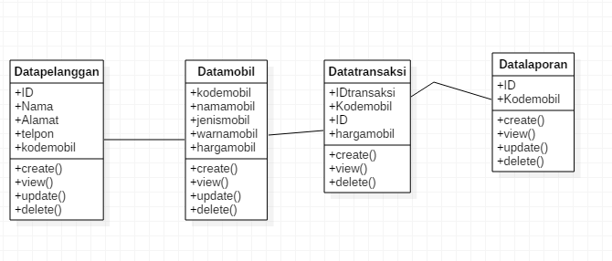

Gambar 3.4 *Class* Diagram

1.  **Sequence Diagram**

>   Sequence diagram disini adalah untuk menggambarkan kolaborasi dinamis antara
>   sejumlah object, yang termasuk ke dalam sistem yang akan dibangun

1.  **Sequence Diagram Login**

Berikut ini merupakan *sequence diagram login* menjelaskan hubungan antara
Admin, pelanggan, halaman login, dan menu utama

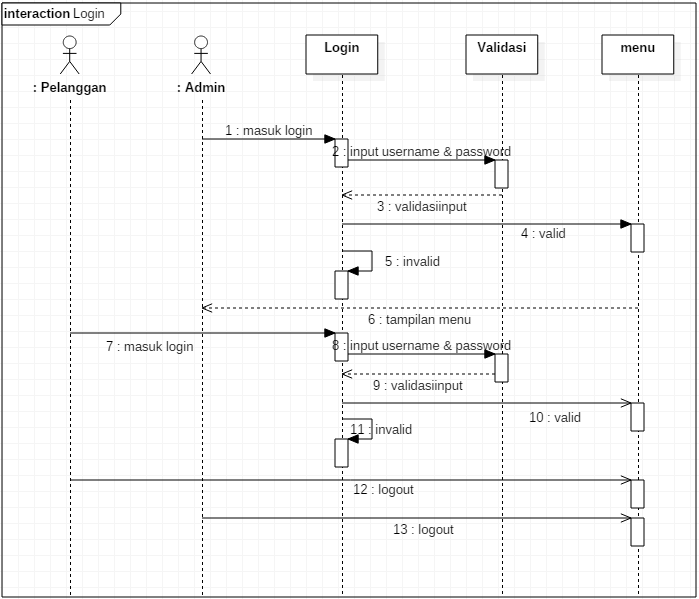

Gambar 3.5 *Sequence* Diagram Login

1.  **Sequence Diagram Kelola Data Laporan**

Berikut ini merupakan *sequence diagram* kelola data laporan menjelaskan hasil
dari aplikasi

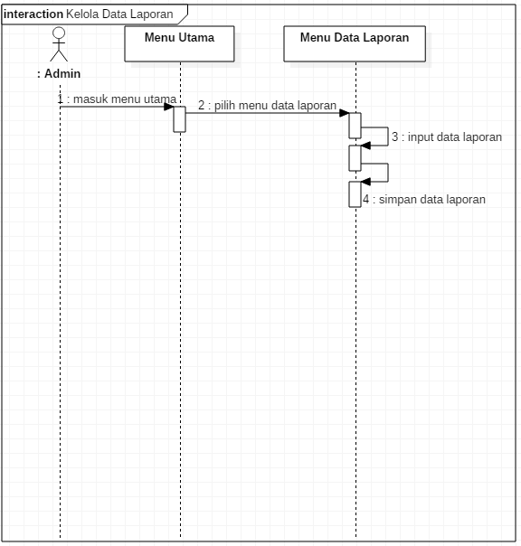

Gambar 3.6 *Sequence* Diagram kelola data laporan

1.  **Sequence Diagram Kelola Data Transaksi**

Berikut ini merupakan *sequence diagram* kelola data transaksi pemberitahuan
prosesnya transaksi.

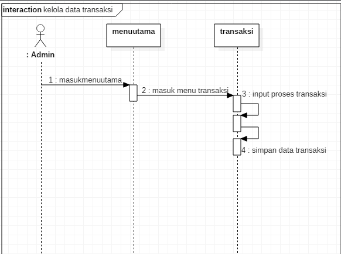

Gambar 3.7 *Sequence* Diagram kelola data transaksi

1.  **Collaboration Diagram**

>   Collaboration diagram disini berfungsi untuk menggambarkan kolaborasi
>   dinamis, dalam menunjukkan pertukaran pesan, menggambarkan object dan
>   hubungannya berkaitan dengan sistem yang akan dibangun.

1.  **Collaboration Diagram Login**

Berikut ini merupakan *Collaboration diagram* Login yang menjelaskan bagaimana
proses login.

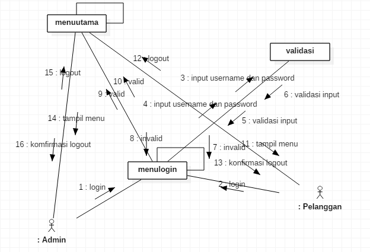

Gambar 3.8 *Collaboration* diagram Login

1.  **Activity Diagram**

**Activity Diagram Diagram Login**

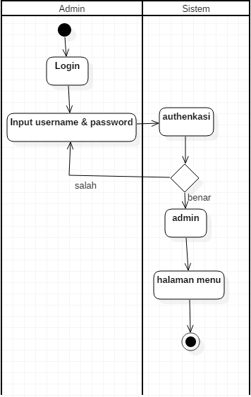

Gambar 3.9 *Activity* diagram Login

1.  **Activity Diagram kelola data laporan**

    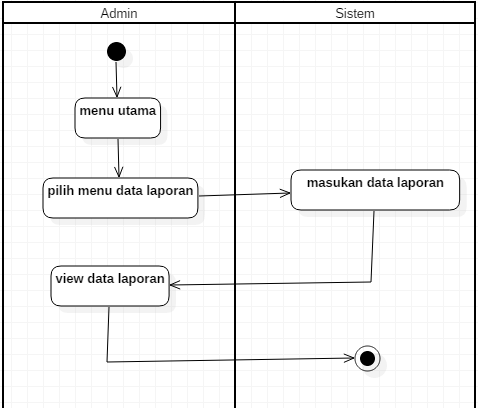

    Gambar 4.0 *Activity* diagram kelola data laporan

2.  **Activity Diagram transaksi**

    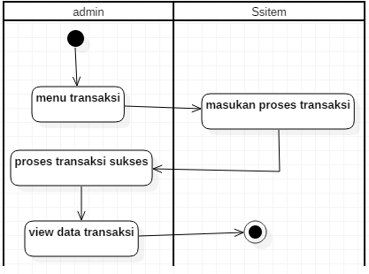

    Gambar 4.1 *Activity* diagram kelola data transaksi

3.  **Statechart Diagram**

>   Statechart disini berfungsi memperlihatkan keadaan-keadaan pada sistem,
>   memuat status (state), transisi, kejadian serta aktivitas.

1.  **Statechart Diagram Login**

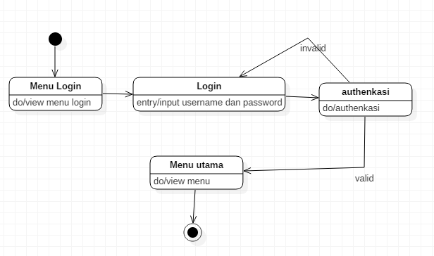

Gambar 4.2 *Statechart* diagram login

1.  **Statechart Diagram Kelola Data Laporan**

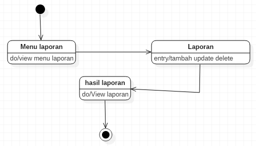

Gambar 4.3 *Statechart* diagram kelola data laporan

1.  **Statechart Diagram transaksi**

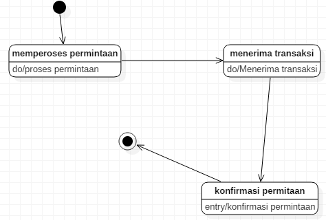

Gambar 4.4 *Statechart* diagram kelola data transaksi  

1.  **Component Diagram**

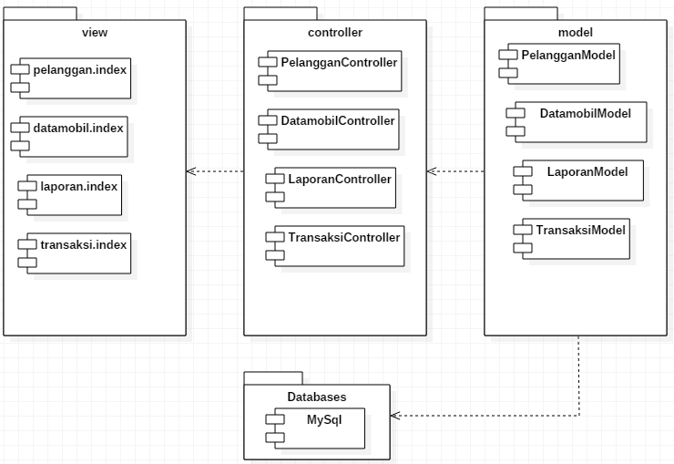

Gambar 4.5 *Component* diagram

1.  **Deployment Diagram**

2.  *Deployment Diagram Software*

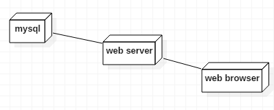

Gambar 4.6 *Deployment* diagram software

1.  *Deployment Diagram Hardware*

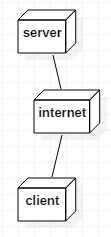

Gambar 4.7 *Deployment* diagram hardware

1.  **Perancangan Database**

    1.  *Conceptual Data Model (CDM)*

    2.  *Physical Data Model*

2.  **Perancangan Aplikasi**

3.  **Arsitektur Perangkat Lunak**

Arsitektur Perangkat Lunak diantaranya :

1.  Sistem Operasi Windows 10 64 Bit.

2.  MySQL Versi 7.0.13.

3.  **Struktur Diagram**

Gambar 5.0 *Sruktur* diagram

1.  **Perancangan Antarmuka**

2.  **Halaman Utama**

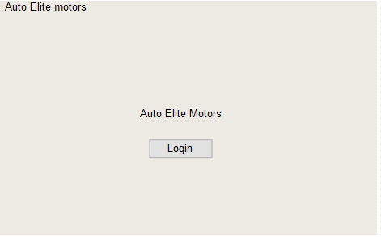

Gambar 5.1 Halama Utama

1.  **Halaman Login**

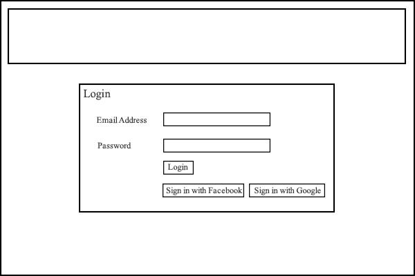

Gambar 5.2 halama login

1.  **Halaman data pelanggan**

    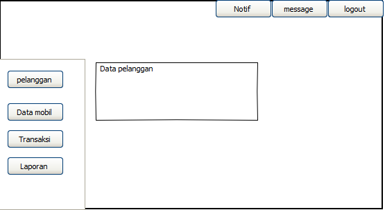

Gambar 5.3 halama data pelanggan

1.  **Hamalan data mobil**

    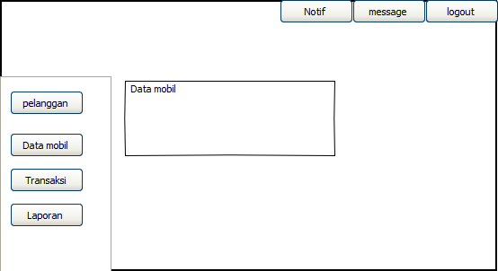

Gambar 5.4 halama data mobil

1.  **Halaman data transaksi**

    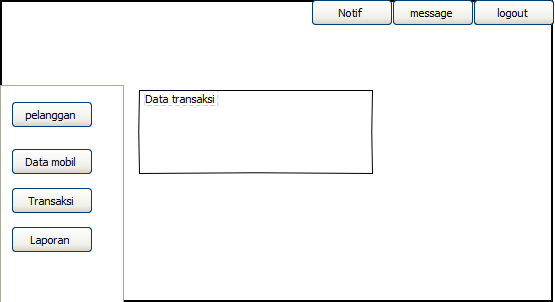

>   Gambar 5.5 halama data transaksi

1.  **Halaman laporan**

    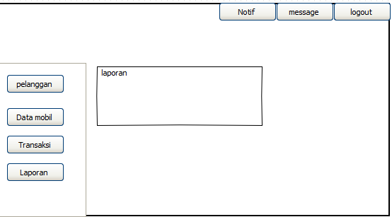

>   Gambar 5.2 halama laporan
